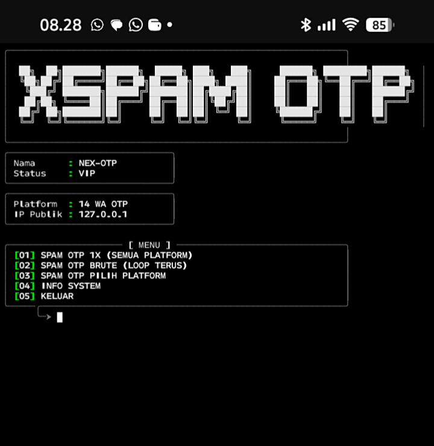

<!--
 ╔═══════════════════════════════════════════════════════════════╗
 ║  🔥 NEX-OTP — OTP Spam Tool (14 Platform WhatsApp)         ║
 ║  Author: YOGGS (github.com/artcasds)                        ║
 ║  Version: 1.0.0                                            ║
 ╚═══════════════════════════════════════════════════════════════╝
-->

<h1 align="center">
  
</h1>

<p align="center">
  
</p>

<p align="center">
  
  
  
  
</p>

---

## ⚠️ PERINGATAN — BACA DULU

> **<span style="color:red">‼️ IMPORTANT</span>**
> 
> Tools ini dibuat untuk **educational & authorized testing purposes ONLY**.  
> Penggunaan untuk spam, pelecehan, doxing, atau aktivitas ilegal lainnya adalah **tanggung jawab penuh pengguna**.  
> **Penulis (YOGGS) tidak bertanggung jawab atas penyalahgunaan tools ini.**  
> Gunakan hanya pada nomor yang Anda miliki atau dengan izin tertulis dari pemilik.

---

## 📌 TENTANG TOOLS

**NEX-OTP** adalah tools otomatis untuk spam otp (One-Time Password) via WhatsApp ke nomor target melalui berbagai platform Indonesia. Tools ini dibuat untuk:

- ✅ Testing keamanan sistem autentikasi OTP
- ✅ Simulasi serangan brute-force pada endpoint OTP
- ✅ Evaluasi rate limiting dan spam protection
- ✅ Penelitian keamanan siber di lingkungan terkontrol

### 🎯 FITUR LENGKAP

| No | Fitur | Deskripsi |
|----|-------|-----------|
| 1 | **14 Platform OTP** | Internet Rakyat, Auto2000, SIDEMANG, PTSP Kemenag, HRS-BRE, Rumah123, Paper.id, DuniaGames, BonusBelanja, Matahari, Klook, PlanetBan, TuneUp, Hainaya |
| 2 | **Mode 1x Spam** | Kirim OTP ke semua platform sekali jalan |
| 3 | **Mode Brute Loop** | Kirim berulang dengan delay custom (default 60 detik) |
| 4 | **Mode Pick Platform** | Pilih platform tertentu, atur jumlah spam sendiri |
| 5 | **Auto Normalisasi** | Support format `08xx`, `62xx`, `+62xx` |
| 6 | **User-Agent Rotator** | Rotasi UA tiap request biar ga gampang kedeteksi |
| 7 | **IP Publik Display** | Tampil di dashboard tools |
| 8 | **Colorful UI** | Terminal visual dengan warna dan border rapi |
| 9 | **Multi-thread IP Fetch** | Ambil IP tanpa nge-blok UI |
| 10 | **Info System** | Tampilkan spesifikasi perangkat (OS, Python, RAM, CPU) |

---

## 🔧 INSTALLASI LENGKAP

### 📋 Prasyarat

| Komponen | Minimal |
|----------|---------|
| Python | 3.8+ |
| Pip | latest |
| Git | latest |

### 🚀 Step-by-Step

#### 1. langkah instalasi 🛠️

```bash
git clone https://github.com/artcasds/VORTEXC-SPAM
cd VORTEXC-SPAM
pip install -r requirements.txt
python vortexc.py
